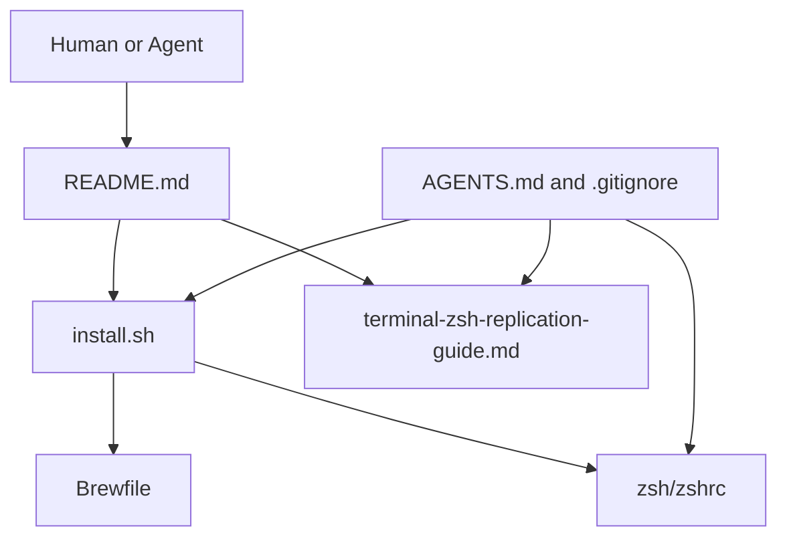
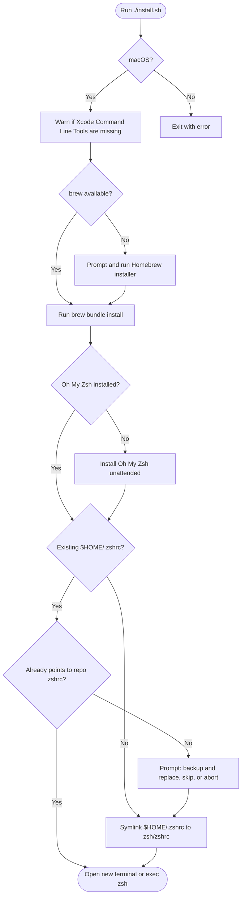
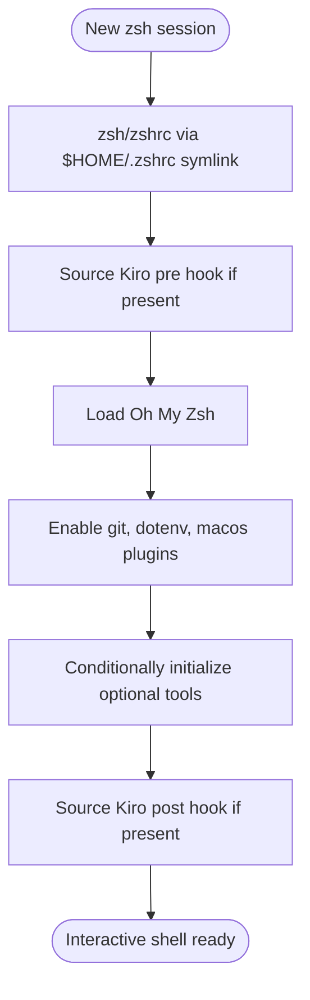
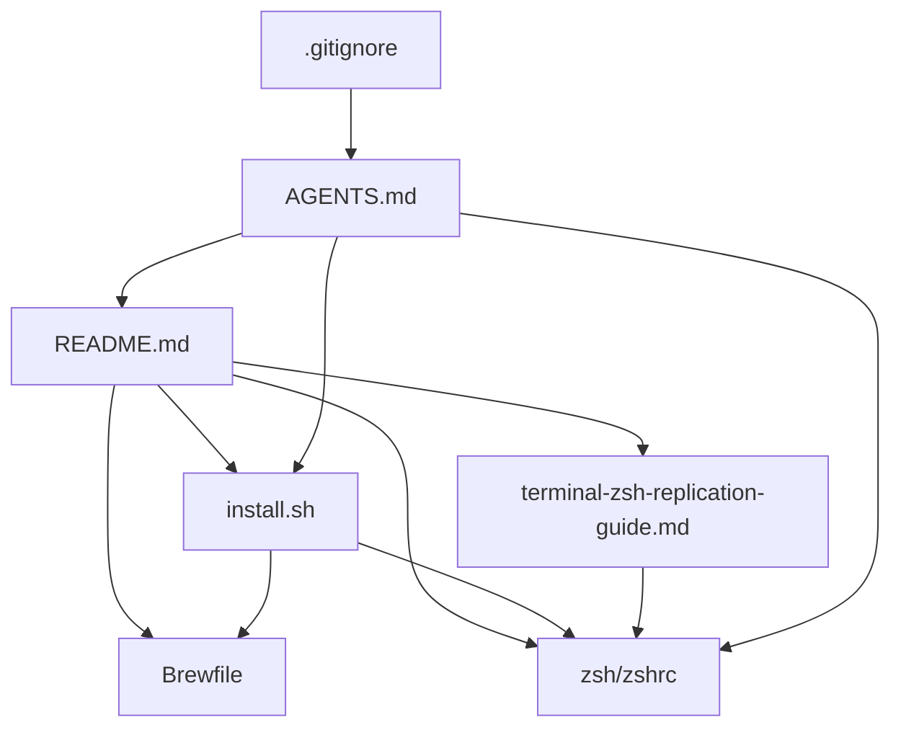

# Architecture: dotfiles

> Last updated: 2026-05-13
> This document describes the high-level architecture of this public dotfiles repository for developers and AI agents working with the codebase.

## Overview

This repository bootstraps a personal macOS shell environment. It installs or wires together Homebrew, Oh My Zsh, a managed zsh configuration, and a small baseline set of command-line tools.

The architecture is intentionally simple: `install.sh` is the orchestration entry point, `Brewfile` defines Homebrew-managed packages, `zsh/zshrc` is the managed shell configuration, and `terminal-zsh-replication-guide.md` documents how to reproduce or validate the same setup on another machine.

Because this repository is public, committed files should contain reusable configuration and documentation only. Machine-specific secrets or private details belong in local-only files outside git.

## Project Type

- **Type**: macOS dotfiles and shell bootstrap repository
- **Primary Language**: Bash and zsh
- **Package Manager**: Homebrew Bundle via `Brewfile`
- **Runtime Target**: macOS with zsh
- **Primary Interface**: Command-line installer plus shell startup configuration

## Entry Points

### Primary Entry Point

**File**: `install.sh`

Running `./install.sh` performs the full bootstrap flow. It validates that the host is macOS, warns if Xcode Command Line Tools appear missing, ensures Homebrew is available, runs `brew bundle install`, installs Oh My Zsh if needed, and offers to symlink `$HOME/.zshrc` to `zsh/zshrc`.

### Runtime Shell Entry Point

**File**: `zsh/zshrc`

This file is loaded by zsh after `$HOME/.zshrc` has been symlinked to it. It initializes Kiro CLI hooks if present, configures Oh My Zsh with the `robbyrussell` theme and selected plugins, and conditionally adds optional local tools to the shell environment.

### Documentation Entry Point

**File**: `README.md`

The README is the human-facing starting point. It explains prerequisites, quick-start setup, what gets linked, Brewfile usage, validation, and optional shell tooling.

### How to Run

```bash
# Bootstrap a machine
chmod +x ./install.sh
./install.sh

# Install or reconcile Homebrew packages after editing Brewfile
brew bundle install --file=Brewfile

# Reload the managed shell config after setup
exec zsh
```

## Client Types and Interfaces

### CLI Installer

The installer is invoked directly by a person or agent on a macOS machine:

- `./install.sh` — runs the bootstrap workflow.
- Interactive prompt when Homebrew is missing — asks whether to run the official Homebrew installer.
- Interactive prompt when `$HOME/.zshrc` already exists — asks whether to back up and replace it, skip, or abort.

### Shell Startup

The shell consumes this repository through the symlink:

- `$HOME/.zshrc` -> `<repo>/zsh/zshrc`

Opening a new zsh session executes the managed configuration and enables the configured prompt, plugins, paths, completions, and optional integrations.

### Documentation

Humans and agents consume the repository through:

- `README.md` — quick start and repository overview.
- `terminal-zsh-replication-guide.md` — detailed replication and validation guide.
- `AGENTS.md` — public-repository safety rules.

## Core Modules

### Module: `install.sh`

**Responsibility**: Orchestrates setup on a macOS machine.

**Key functions**:

- `warn_no_xcode_clt()` — warns when Command Line Tools are not detected.
- `ensure_brew_on_path()` — finds Homebrew on `PATH`, Apple Silicon, or Intel install locations.
- `install_homebrew_if_needed()` — optionally runs the official Homebrew installer.
- `run_brew_bundle()` — installs packages from `Brewfile`.
- `install_oh_my_zsh_if_needed()` — installs Oh My Zsh unattended when missing.
- `prompt_and_link_zshrc()` — manages the `$HOME/.zshrc` symlink safely.

**Dependencies**: macOS, zsh/bash-compatible shell utilities, `curl`, `python3`, Homebrew, network access for first-time installs.

### Module: `zsh/zshrc`

**Responsibility**: Defines the active shell environment once linked into `$HOME/.zshrc`.

**Key behavior**:

- Sources Kiro CLI pre and post hooks if present.
- Configures Oh My Zsh with `robbyrussell`.
- Enables Oh My Zsh plugins: `git`, `dotenv`, and `macos`.
- Initializes optional tooling only when installed: atuin, Volta, nvm, Postgres.app client tools, Grafbase CLI, and Apollo Rover completions.
- Keeps optional project-specific aliases commented out with `$HOME` placeholders.

**Dependencies**: `$HOME/.oh-my-zsh`, optional local installations, and platform-specific Homebrew paths.

### Module: `Brewfile`

**Responsibility**: Declares Homebrew-managed baseline packages.

**Current packages**:

- `nvm` — Node version manager loaded conditionally by `zsh/zshrc`.

**Dependencies**: Homebrew Bundle.

### Module: `terminal-zsh-replication-guide.md`

**Responsibility**: Provides a detailed checklist for reproducing, validating, and troubleshooting the shell setup.

**Key sections**:

- What the setup replicates.
- Core Oh My Zsh setup.
- Optional Kiro, atuin, Volta, nvm, Postgres.app, Grafbase, and Rover tooling.
- Validation checks for prompt, plugins, aliases, and optional components.
- Troubleshooting guidance for common startup problems.

### Module: `AGENTS.md`

**Responsibility**: Defines safety constraints for humans and coding agents.

**Key rule**: Treat committed content as world-readable. Do not add secrets, credentials, private keys, private hostnames, or machine-specific personal data.

### Module: `.gitignore`

**Responsibility**: Prevents local-only files and common secret-bearing artifacts from being committed.

**Ignored examples**:

- `Brewfile.lock.json`
- `.env` and `.env.*`
- private key-like files such as `*.pem`, `id_rsa`, and `id_ed25519`
- local IDE metadata

## Architecture Diagrams

### High-Level Architecture



### Bootstrap Flow



### Shell Startup Flow



### Module Dependencies



## Data Layer

This repository has no application data layer, database, migrations, or persistent service storage.

Local machine state is managed outside the repository:

- Homebrew installation and formulae live under the host's Homebrew prefix.
- Oh My Zsh lives under `$HOME/.oh-my-zsh`.
- The active shell configuration is loaded through `$HOME/.zshrc`.
- Optional tool state, credentials, history, and caches live under their own local directories and should not be committed.

## External Dependencies

### Install-Time Dependencies

- **macOS** — required host operating system.
- **Xcode Command Line Tools** — commonly required by Homebrew and compiled packages.
- **Homebrew** — installed by `install.sh` if missing and approved by the user.
- **Homebrew Bundle** — used to install packages from `Brewfile`.
- **Oh My Zsh** — installed by `install.sh` if `$HOME/.oh-my-zsh` is missing.
- **Network access** — required for first-time Homebrew and Oh My Zsh installs.

### Shell Runtime Dependencies

- **Oh My Zsh** — provides theme and plugins.
- **Kiro CLI** — optional pre/post startup hooks.
- **atuin** — optional shell history initialization.
- **Volta** — optional Node toolchain path.
- **nvm** — optional Node version manager installed through Homebrew.
- **Postgres.app** — optional PostgreSQL client tools path.
- **Grafbase CLI** — optional path entry.
- **Apollo Rover** — optional completion file.

## Configuration

### Managed Configuration

- `zsh/zshrc` — committed zsh configuration intended to be symlinked from `$HOME/.zshrc`.
- `Brewfile` — committed Homebrew package list.

### Local-Only Configuration

Keep secrets and machine-specific values outside this repository. Good local-only places include:

- `$HOME/.zshrc.local`
- `$HOME/.env`
- private repositories
- tool-specific config directories under `$HOME`

If local-only shell settings are needed in the future, add a conditional source line using a `$HOME` placeholder and keep the target file ignored or outside git.

## Testing and Validation

There is no automated test suite. Validation is manual and documented in `terminal-zsh-replication-guide.md`.

Useful checks after setup:

```bash
echo $SHELL
echo $ZSH
echo $ZSH_THEME
alias gst
type gst
command -v nvm
```

Primary validation areas:

- zsh starts without errors.
- Oh My Zsh loads the `robbyrussell` theme.
- Oh My Zsh plugins expose expected aliases such as `gst`.
- Optional integrations are skipped cleanly when not installed.
- `$HOME/.zshrc` points at `zsh/zshrc` when the user chose repository-managed config.

## Build and Deployment

This repository has no build artifact or deployment pipeline.

The closest equivalent to deployment is running `./install.sh` on a macOS machine. Pulling future repo updates changes the managed shell config for the next new shell session because `$HOME/.zshrc` is a symlink into the repository.

## Common Patterns

- **Idempotent checks**: Installer functions check whether Homebrew, Oh My Zsh, and the zsh symlink already exist before changing state.
- **Interactive safety gates**: Potentially disruptive steps ask before installing Homebrew or replacing an existing `$HOME/.zshrc`.
- **Conditional optional tooling**: `zsh/zshrc` tests for files or commands before sourcing or modifying `PATH`.
- **Public-repo hygiene**: Docs and config use `$HOME` placeholders and avoid secrets or private local paths.
- **Apple Silicon and Intel support**: Homebrew paths are checked under both `/opt/homebrew` and `/usr/local`.

## Development Workflow

1. Edit repo-managed files such as `zsh/zshrc`, `Brewfile`, or documentation.
2. Keep machine-specific values and secrets outside git.
3. Run `brew bundle install --file=Brewfile` after changing Homebrew packages.
4. Start a new terminal or run `exec zsh` after changing `zsh/zshrc`.
5. Use `terminal-zsh-replication-guide.md` section 4 to validate prompt, plugins, aliases, and optional tools.
6. Before committing, scan changes for secrets, tokens, private keys, and accidental local paths.

## Glossary

- **Brewfile**: Homebrew Bundle manifest that declares packages to install.
- **Oh My Zsh**: zsh framework that provides themes, plugins, and shell conveniences.
- **Managed zshrc**: The committed `zsh/zshrc` file used through a symlink from `$HOME/.zshrc`.
- **Optional integration**: Tool-specific shell setup that runs only when the tool is installed locally.

## Additional Resources

- `README.md` — quick start and overview.
- `terminal-zsh-replication-guide.md` — detailed setup, validation, and troubleshooting guide.
- `AGENTS.md` — safety rules for public repository contributions.
